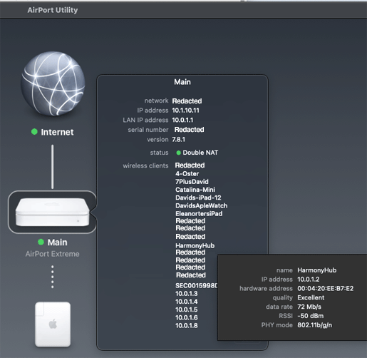
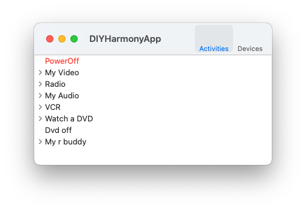

# DIYHarmony

This repo is a functioning mac ap for controlling a Harmony Hub on the same WiFi network as the Mac.

It has no external dependencies - it just uses the built-in macOS SDK. The core files: DIYHarmonyHub.m and its network
response  file: DIYResponse.m should compile and run on iOS and watchOS. You should be able to use them in
a Swift app without problem.

It is based on the README in https://github.com/NovaGL/diy-harmonyhub on how to access the new Harmony
Hub API over Websockets and HTTP POST, copied here as [Harmony Hub Websocket API.md](Harmony%20Hub%20Websocket%20API.md).

### Usage

* Tell **DIYHarmony** the 10.0.10.20 style IP address of your Harmony Hub. In my case, I used Airport Utility and clicked on my main base station, then clicked on "Harmony Hub" and saw that my hub was at 10.0.1.2 :

**DIYHarmony** will get the configuration from the hub, and show it as a table of activities and a table of devices. You can click the disclosure triangle to show button groups. Click those to see individual buttons. Double-clicking on an activity chooses it. Double-clicking on a button sends that button press. Here's what it looks like for me:

### How it works:

**DIYHarmony** creates and retains a NSURLSession. After an initial HTTP POST to get a remote ID, it uses a
NSURLSessionWebSocketTask to send and receive messages from the Harmony Hub.

### Compatibility : 

**DIYHarmony** has been tested and works on macOS 11 (Big Sur), and should work on macOS 10.15 (Catalina).
It uses NSURLSession's support for webSockets, which was introduced in 10.15.

That same support is available starting in iOS 13, watchOS 6, and tvOS 13.

### Build Instructions

Set the bundle ID to your bundle ID. Adjust the code signing.

### TODO

* The mac UI is terrible. It's just a proof of concept that I can run activities and push buttons. Replace it with a nice U.I.
* Design an implement an iOS U.I. Once for phone, and one for iPad.
* Design and implement a watchOS U.I.
* Better error handling: now, when things go wrong, it just logs to the console. That's convenient when running from
Xcode, but not out in the field.

### Versions

1.0 - 1/20/2021 initial release.

### License: 

Apache 2. See the LICENSE file in this repository.

